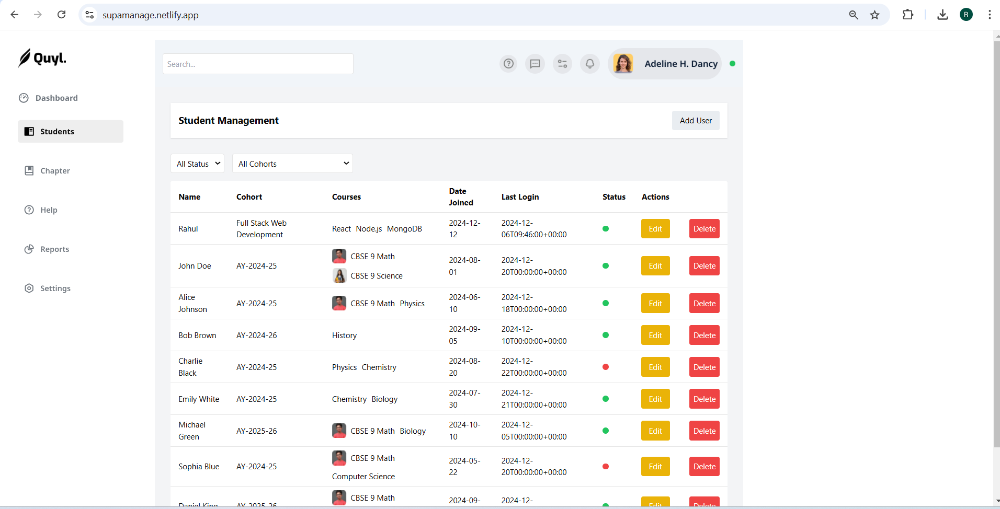

# User Management Application

## Deployed Link
You can view the live deployed version of the project at:  
[**SUPAMANAGE**](https://supamanage.netlify.app/)

## Landing Page Image
Here’s a preview of the landing page:

## Features:
- **User CRUD Operations**: Add, Edit, Update, and Delete users.
- **Filtering**: Filter users by active status and cohort.
- **Form for User Data**: Inputs for managing user details like name, cohort, courses, date joined, and last login.
- **Real-time Updates**: Automatically updates the UI when users are added, updated, or deleted.
- **Status Indicator**: Displays user status (Active or Inactive) using color codes.

## Core Components:
1. **Canvas Component**:
   - Displays the user interface for adding, editing, and filtering users.
   - **Add/Edit User Form**: Handles the input fields for new or existing users.
   - **Filter Section**: Allows filtering users by status and cohort.
   - **User Table**: Displays a list of users, their information, and action buttons for editing and deleting.

2. **Redux Store (userSlice)**:
   - Contains the logic to fetch, add, update, and delete users from Supabase.
   - Uses `createAsyncThunk` to handle async actions related to fetching, adding, updating, and deleting data.
   - Stores the user data in the state and handles error and loading states.

3. **Supabase Integration**:
   - Used for managing users in the database, performing CRUD operations, and handling real-time changes.

## Detailed Breakdown:

### 1. **Canvas Component (Canvas.jsx)**
- **State Management**:
  - `newUser State`: Manages form input for user data (e.g., name, cohort, courses, etc.).
  - `filters State`: Holds filter options for user data (e.g., filter by active status or cohort year).
  
- **Hooks and Effects**:
  - `useEffect`: Fetches user data from Supabase when the component mounts (`dispatch(fetchUsers())`).
  - `useSelector`: Retrieves users from the Redux store.
  - `useDispatch`: Dispatches Redux actions (e.g., `addUser`, `updateUser`, `deleteUser`).

- **Event Handlers**:
  - `handleAddUser`: Adds or updates a user based on whether a new user is being created or an existing one is being updated.
  - `handleEditUser`: Populates the form with the user data to edit.
  - `handleDeleteUser`: Deletes a user from the list and the Supabase database.

- **UI Sections**:
  - **User Form**: Includes fields for name, cohort, courses, dateJoined, lastLogin, and status.
  - **Filters**: Dropdowns allow filtering users by status (active/inactive) and cohort.
  - **User Table**: Displays the user data in a tabular format, with action buttons for editing and deleting.

### 2. **Redux Slice (userSlice.js)**
- **Async Actions**:
  - `fetchUsers`: Fetches all users from Supabase.
  - `addUser`: Adds a new user to Supabase.
  - `updateUser`: Updates an existing user in Supabase.
  - `deleteUser`: Deletes a user from Supabase.

- **Reducers**:
  - **extraReducers**: Handles the results of the async actions (`pending`, `fulfilled`, `rejected`).
  - **State Structure**:
    - `users`: Array containing user data.
    - `status`: Tracks the loading, succeeded, or failed status of the async actions.
    - `error`: Stores any error message from failed async actions.

### 3. **Supabase Integration**
- Used for managing users in the database, performing CRUD operations, and handling real-time changes:
  - `supabase.from("users").select("*")`: Fetches all user data from the `users` table.
  - `supabase.from("users").insert()`: Inserts a new user into the `users` table.
  - `supabase.from("users").update()`: Updates an existing user in the `users` table.
  - `supabase.from("users").delete()`: Deletes a user from the `users` table.

### 4. **User Table UI**
- The user table displays the following columns:
  - **Name**: The name of the user.
  - **Cohort**: The cohort year the user belongs to.
  - **Courses**: A comma-separated list of courses the user is enrolled in.
  - **Date Joined**: The date the user joined (formatted as YYYY-MM-DD).
  - **Last Login**: The last login time (formatted as YYYY-MM-DDTHH:MM).
  - **Status**: A color indicator showing whether the user is active (green) or inactive (red).
  - **Actions**: Buttons to edit or delete the user.

### 5. **Error Handling**
- The app handles errors from Supabase API calls by:
  - Displaying an error message in the UI when an action fails.
  - Logging errors to the console for debugging purposes.

### 6. **Styling**
- Tailwind CSS is used for styling:
  - Flexbox layout for alignment and spacing.
  - Buttons with colors for different actions (e.g., Add, Edit, Delete).
  - A table for displaying user information.

---

Feel free to check out the project and explore its features!
